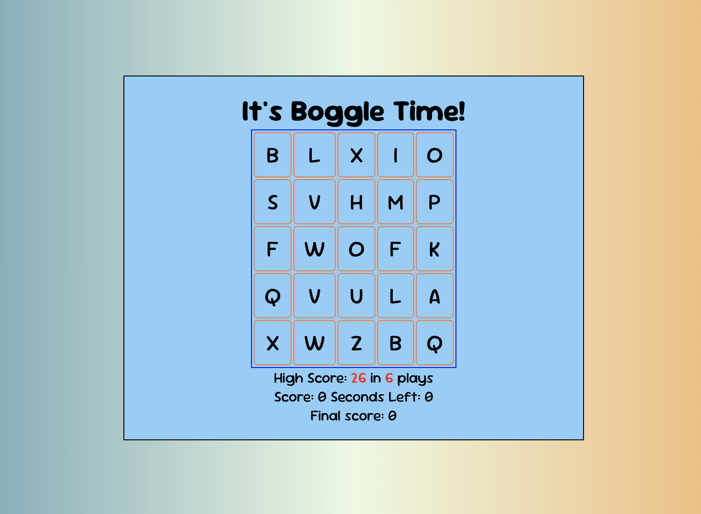

# bc20-5_flask-boggle
This is a solution to the flask boggle challenge 

## Table of Contents
- [Overview](#overview)
  - [The challenge](#the-challenge)
  - [Screenshot](#screenshot)
- [My process](#my-process)
  - [Built with](#built-with)
  - [What I learned](#what-i-learned)
  - [Continued development](#continued-development)
  - [Useful resources](#useful-resources)
- [Author](#author)

## Overview
The goal of the game is to get the highest point total. To gain points, players create words from a random assortment of letters in a 5x5 grid. We will be providing the functionality to generate the grid.

### The challenge
- Generate a random Boggle board.
- Validate user-inputted words against the generated board.
- Keep track of the user's score.
- Display the highest score achieved.

### Screenshot

### Built with
- Python
- Flask
- JavaScript
- jQuery
- Axios
- CSS custom properties
- Flexbox

### What I learned

I got to practice putting a lot of pieces together to make this project function. 

### Continued development

I would like to make the game look better with some updates. I focussed on understanding how the project 

### Useful resources

- [MDN](https://developer.mozilla.org/en-US/) - As always, I used the MDN resource when I had a quick question.
- [Springboard] (https://www.springboard.com/) - where the challenge came from

## Author

- Website - [DNel2](https://github.com/TechEdDan2)
- Frontend Mentor - [@TechEdDan2](https://www.frontendmentor.io/profile/TechEdDan2)
